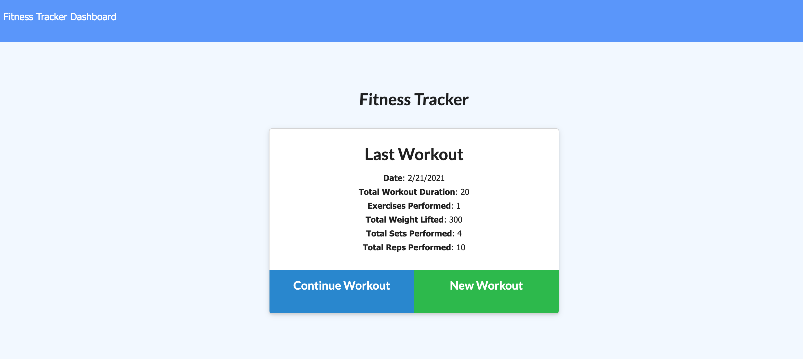
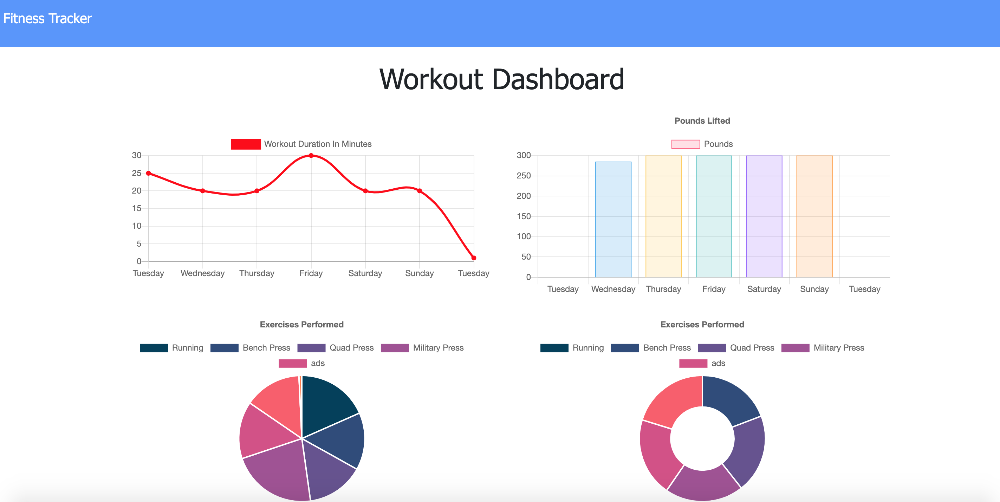
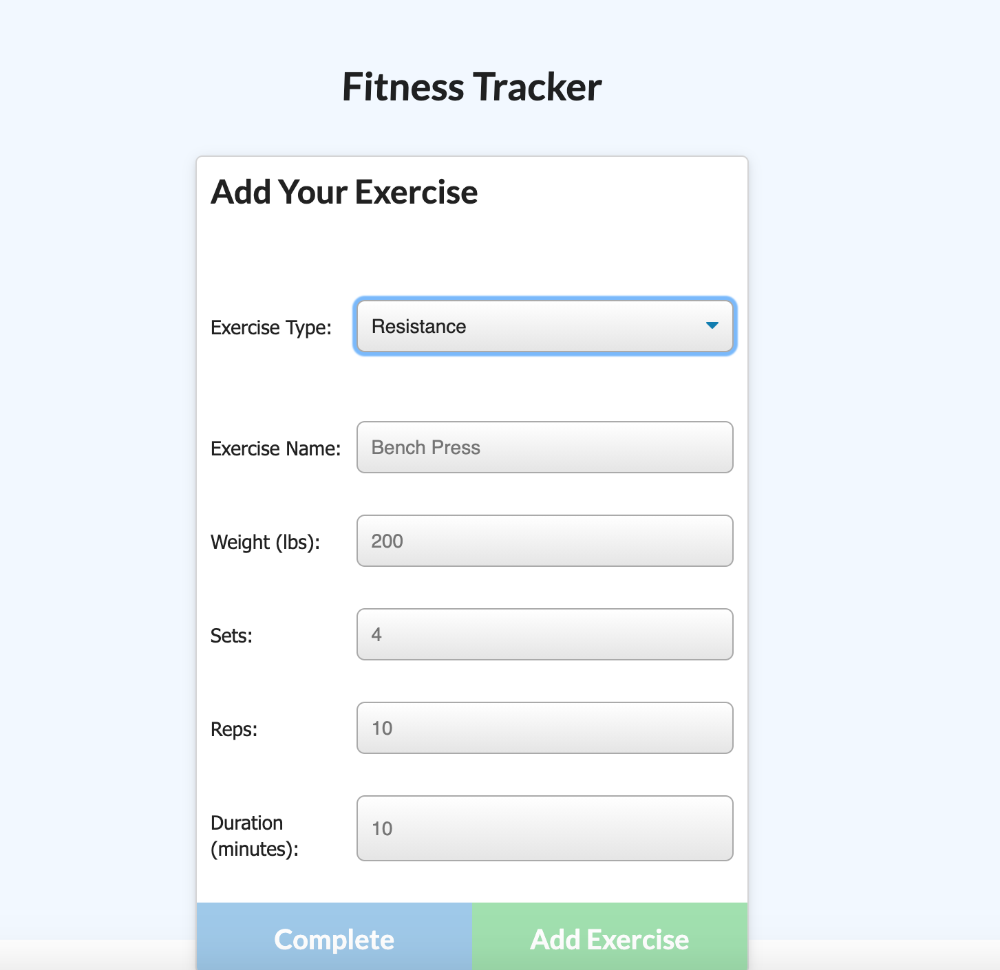

# Philip-DiPaula-OSU-bootcamp-hwk17-Workout-Tracker

## These are the files for the homework assignment associated with section 17 of the OSU Web Development Bootcamp

* Here is a link to the [github](https://github.com/pjdip/Philip-DiPaula-OSU-bootcamp-hwk14-Workout-Tracker)
* Here is a link to the deployed application on [heroku](https://whispering-plains-28317.herokuapp.com/)

The goal of this assignment was to build an MVC application for tracking workout sessions and exercises using a [mongodb](https://www.mongodb.com/) database, [mongoose](https://www.npmjs.com/package/mongoose), and [express](https://www.npmjs.com/package/express) in [node](https://nodejs.org/en/download/).

* [Installation](#installation)
* [Usage](#usage)
* [Credits](#credits)
* [Badges](#badges)
* [License](#license)

## Installation

Installation requirements include node.js, mongodb, and the express/mongoose/morgan npm packages.
You will find package dependency .json files in the github repo that should allow the npm packages to work without any further effort on your end. You will need to install node and mongodb on your own. Installation options for node can be found [here](https://nodejs.org/en/download/). Installation options for MongoDB can be found [here](https://docs.mongodb.com/manual/installation/)

## Usage 

In order to use this application, you can either access it through the heroku link, or clone the repo to your local machine. Then use the command line to navigate to the main folder containing server.js. Once you have MongoDB installed, you should be able to start the server using the command 'node server.js'. If you are successful, there will be a console.log statement alerting you that the app is running on port 8080. If you have any troubles running the application, try doing 'npm install' from the main folder and then try again.

Once you have the server running, if you go to your browser and head to the address "http://localhost:8080/" you should be presented with the home page of the app. From here you've got some options. The main card will display the information about the most recent workout, including the date, duration, number of exercises performed, total weight lifted, total sets and reps performed and distance if there was any cardio performed. From here, you can choose to continue a previous workout or create a new workout. After choosing one of these options, you can add a new exercise to the current workout. First choose between cardio and resistance training. From there, fill in the necessary info and click the add exercise button. When adding the final exercise of the workout click the complete button and you will be returned to the landing page. From here, you may click the Dashboard button to view stats from the past 7 days.

Here are some screenshots:

Main Page: 

Stats: 

addExercise: 

## Credits

Special Thanks to express documentation:
* [npm](https://www.npmjs.com/package/express)
* [docs](https://expressjs.com/en/guide/routing.html)

Special Thanks to mongoose documentation:
* [npm](https://www.npmjs.com/package/mongoose)
* [docs](https://mongoosejs.com/docs/api.html)
* [aggregate](https://mongoosejs.com/docs/api.html#aggregate_Aggregate)
* [relationships](https://bezkoder.com/mongoose-one-to-many-relationship/)
* [schema](https://arunrajeevan.medium.com/mongodb-schema-using-mongoose-19aeffdf772f)

Special Thanks to mongodb documentation:
* [aggregation](https://docs.mongodb.com/manual/meta/aggregation-quick-reference/#aggregation-expressions)
* [addFields](https://docs.mongodb.com/manual/reference/operator/aggregation/addFields/)
* [sum](https://docs.mongodb.com/manual/reference/operator/aggregation/sum)

Special Thanks to [ChilledCow](https://www.youtube.com/channel/UCSJ4gkVC6NrvII8umztf0Ow) for providing chill lofi beats to code to

## Badges

## License

Licensed under the [GNU General Public License v3.0](https://choosealicense.com/licenses/gpl-3.0/)

---